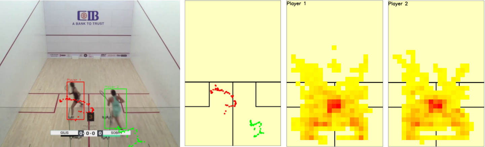

# Squash_heat_maps
This project processes squash videos and creates heatmaps that players/coaches can use to improve their game. 

Colab description: *https://colab.research.google.com/drive/1XQhroKiA16F3tn2QSVCW7ZbdzstIhkrc?usp=sharing*

## Usage
### Step 1
Utilize exportframe.py to obtain court dimensions from the video frame. This file will save a picture frame to the output directory. 

**Example:** *python3 exportframe.py --video_path=./resources/video01.mp4*

Once the frame picture has been exported, use a picture editing tool to identify the four vertices as shown in the image below. Provide these vertices to the heat map file below. 

### Step 2
Once vertices are available, us the main heatmap file with coordinates and a video path to process the video. 

**Example:** *python3 squash_heat_map.py --video_path='./resources/video02.mp4' --coordinates=[[434,285],[830,285],[927,458],[340,457]] --verbose=TRUE*

The sample outlook will look like the picture below. The heatmaps can be studied and used for coaching. 

